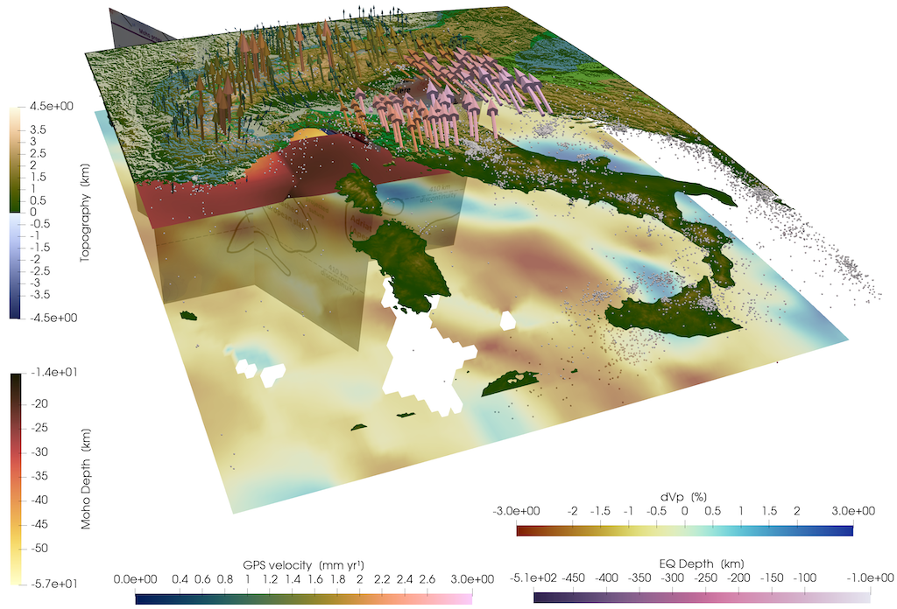

# Geophysical Model Generator

[](https://juliageodynamics.github.io/GeophysicalModelGenerator.jl/dev)
[](https://juliageodynamics.github.io/GeophysicalModelGenerator.jl/dev/)
[](https://github.com/JuliaGeodynamics/GeophysicalModelGenerator.jl/actions)

While Geophysics and Geology offer an increasing number of 3D images of the subsurface, turning them into an input model for geodynamic simulations remains challenging. This package:

(1) **provides** several routines to import data in the VTK-toolkit format, which can be visualized with state-of-the-art tools like [Paraview](https://www.paraview.org);

(2) **proposes** tools to generate input models to perform geodynamic simulations and import their results back into Julia;

(3) **offers** to applied geophysicists and geologists open-access tools to visualize legacy or novel quantitative and conceptual models.


### Contents
* [Main features](#main-features)
* [Usage](#usage)
* [Installation](#installation)
* [Dependencies](#dependencies)
* [Alpine Data](#visualising-alpine-data)
* [Contributing](#contributing)
* [Development roadmap](#development-roadmap)
* [Funding](#funding)

## Features
- Visualize geophysical models of the subsurface in 3D, as those from seismic and electromagnetic tomography.
- Handle the visualization of 2D data through cross sections and surfaces, as those necessary to exploration seismology Moho depth imaging.
- Plot data along lines (e.g., drillholes) or at points (e.g., earthquake locations, GPS velocities).
- Handle both scalar and vector data sets.
- Grab screenshots of cross-sections or maps in published papers and transform them in 3D numerical models.
- Create a unified visualization that includes all available data for a certain region.
- Create initial model setups for the 3D geodynamic code [LaMEM](https://bitbucket.org/bkaus/lamem/src/master/) and import LaMEM timesteps for movie generation.

## Format
All data are transformed into either a `GeoData` or a `CartData` structure. These structures contain an arbitrary number of scalar/vector datasets mapped in `longitude/latitude/depth` or `x/y/z`. All data can be exported to Paraview with the `Write_Paraview` routine.

## Documentation and Usage
The best way to learn how to use the Geophysical Model Generator is to install the package (see below) and do the tutorials in the [manual](https://juliageodynamics.github.io/GeophysicalModelGenerator.jl/dev/).

## Installation
First, you need to install Julia on your machine. We recommend using the binaries from [https://julialang.org](https://julialang.org).
Next, start Julia and switch to the Julia package manager using `]`, after which you can add the package.
```julia
julia> ]
(@v1.6) pkg> add GeophysicalModelGenerator
```
You can test whether it works on your system with
```julia
julia> ]
(@v1.6) pkg> test GeophysicalModelGenerator
```
and use it with
```julia
julia> using GeophysicalModelGenerator
```

## Dependencies
We rely on additional packages, which are all automatically installed:
- [GeoParams.jl](https://github.com/JuliaGeodynamics/GeoParams.jl) defines dimensional units, and makes conversions easy, as those from km/s to m/s, etc;
- [WriteVTK.jl](https://github.com/jipolanco/WriteVTK.jl) writes VTK files (to be opened with Paraview);
- [ImageIO.jl](https://github.com/JuliaIO/ImageIO.jl), [FileIO.jl](https://github.com/JuliaIO/FileIO.jl), [Colors.jl](https://github.com/JuliaGraphics/Colors.jl), and [Interpolations.jl](https://github.com/JuliaMath/Interpolations.jl) are necessary to import screenshots from papers.


## Visualising Alpine data
We have used this package to interpret various data sets of the Alps (mostly openly available, sometimes derived from published papers). You can download the resulting paraview files here (using the `*.vts` format), where we also included the Julia scripts to do the work (some of which are also described in more detail in the tutorials). Just unzip the files and open the corresponding `*.vts` in Paraview.

[https://seafile.rlp.net/d/22b0fb85550240758552/](https://seafile.rlp.net/d/22b0fb85550240758552/)

If you want to create the visualization for your area and data give us an email (or even better: send the files with Julia scripts).

## Contributing
You are very welcome to request new features and point out bugs by opening an issue. You can also help by adding features and creating a pull request.

## Development roadmap
In the pipeline:
- More tutorials;
- Add more import tools;
- Compute gravity anomalies for lon/lat datasets, rather than just x/y/z;
- Provide an interface to [geomIO](https://bitbucket.org/geomio/geomio/wiki/Home) (currently being translated from MATLAB to python) in order to create 3D geometric model setups by drawing in Inkscape; 
- Provide tools to create and export 3D geodynamic model setups.

## Funding
Development of this software package was funded by the German Research Foundation (DFG grants TH2076/7-1 and KA3367/10-1), which are part of the [SPP 2017 4DMB project](http://www.spp-mountainbuilding.de) project as well as by the European Research Council under grant ERC CoG #771143 - [MAGMA](https://magma.uni-mainz.de).
