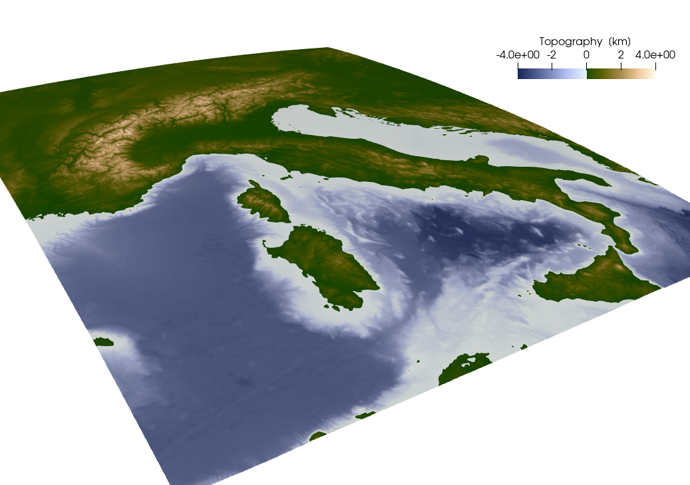
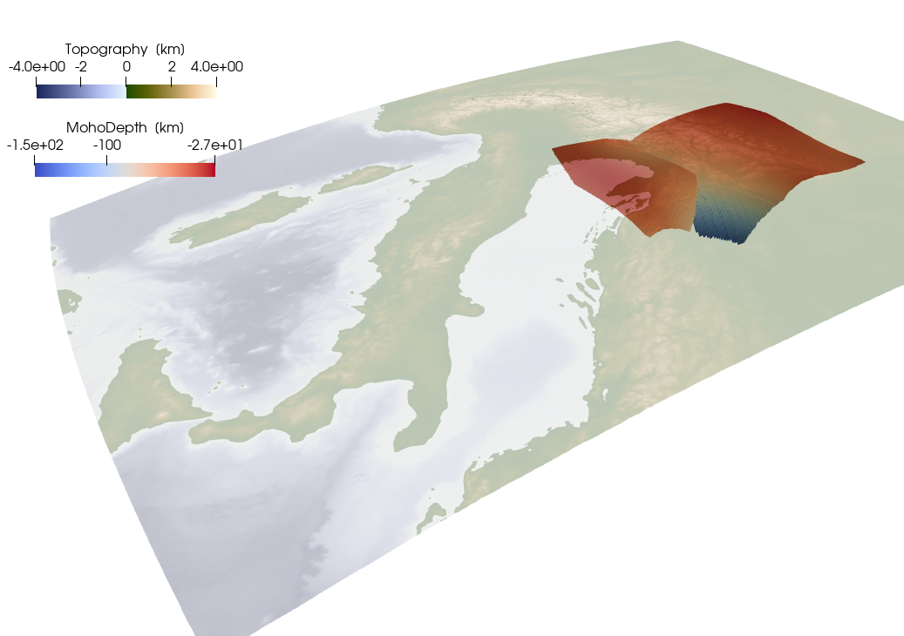
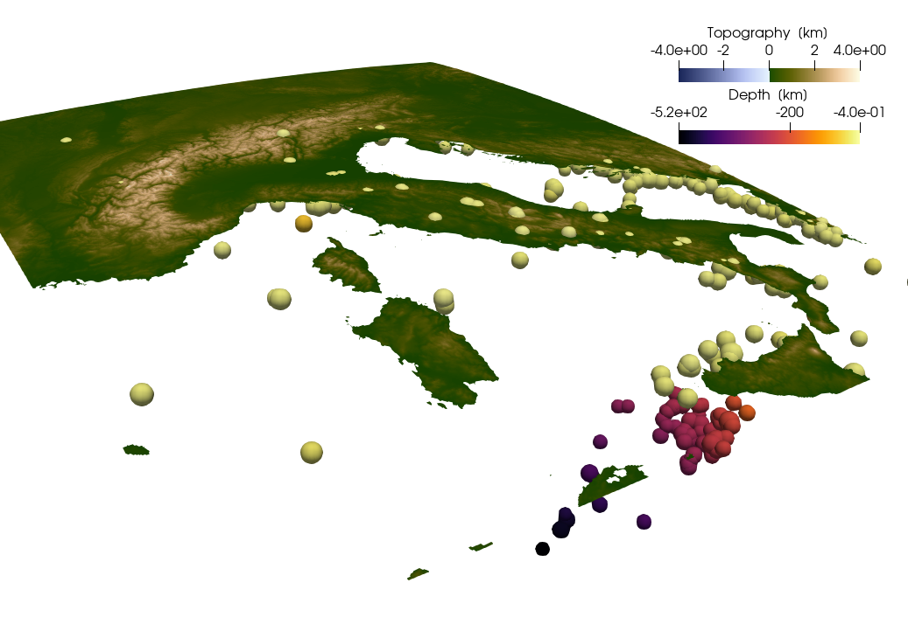
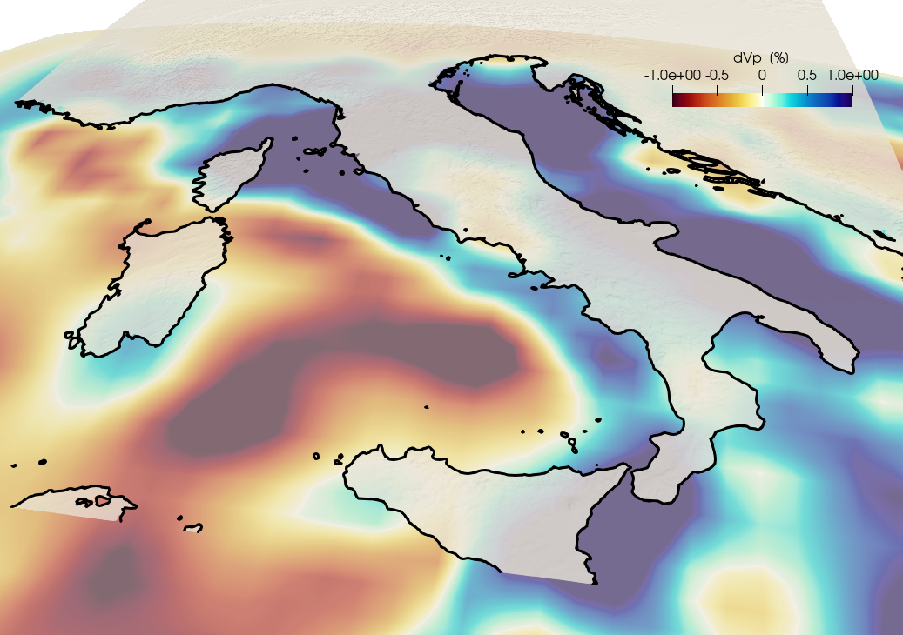
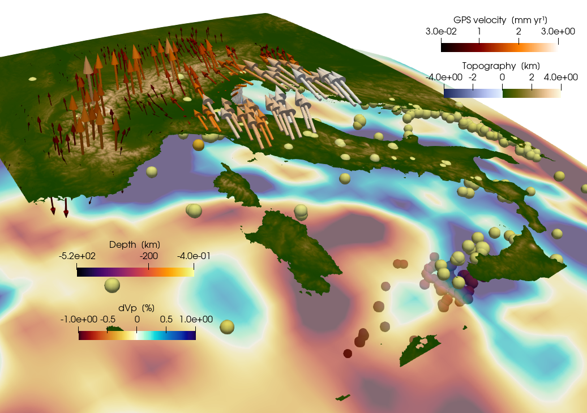

```@meta
EditURL = "../../../tutorials/Tutorial_AlpineData.jl"
```

# Alpine Data Visualization

## Goal
This is a tutorial to:
1. Download datasets from known sources
2. Process and unify these datasets with `GeophysicalModelGenerator`
3. Save the resulting dataset
4. Export the datasets to Paraview

This is a rather lengthy tutorial that combines different other tutorials, but it will guide you through all the steps necessary to obtain a somewhat comprehensive view of the European Alps and their subsurface from a geodynamical point of view.

## 1. Surface Topography
In many cases, we want to add topographic data to our visualization. Here we use [GMT.jl](https://github.com/GenericMappingTools/GMT.jl) to download data from a certain region, and transfer that to `GMG`.
To add the GMT package, simply add it with the julia package manager:
```julia
julia> ]
(@v1.10) pkg> add GMT
```
and load both `GMG` and `GMT` with:

```julia
using GeophysicalModelGenerator, GMT
```

When loading both packages, several `GMT` routines within `GMG` will be loaded. One of these routines is the function `importTopo`, where one simply has to provide the region for which to download the topographic data and the data source.

```julia
Topo = importTopo([4,20,37,50], file="@earth_relief_01m.grd")
```

The data is available in different resolutions; see [here](http://gmt.soest.hawaii.edu/doc/latest/grdimage.html) for an overview. Generally, it is advisable to not use the largest resolution if you have a large area, as the files become very large.

If you have issues with loading the topography with `GMT`, there is also the alternative to download the data yourself and import it using `Rasters.jl`.

We can now export this data to a `VTK` format so that we can visualize it with `Paraview`. To do so, `GMG` provides the function `write_Paraview`:

```julia
write_Paraview(Topo, "Topography_Alps")
```

Also, if you want to save this data for later use in julia, you can save it as `*.jld2` file using the function `save_GMG`:

```julia
save_GMG("Topography_Alps",Topo)
```

The result looks like:

Note that we used the `Oleron` scientific colormap from [here](https://www.fabiocrameri.ch/colourmaps.php) for the topography.

##  2. Moho topography
When looking at data concerning the Alpine subsurface, we are often interested in the depth of the [Moho](https://en.wikipedia.org/wiki/Mohorovi%C4%8Di%C4%87_discontinuity).
### 2.1 Download and import of the data
Here, we will use the dataset from Mroczek et al. (2023). This dataset is publicly available and can be downloaded from [here](https://datapub.gfz-potsdam.de/download/10.5880.GFZ.2.4.2021.009NUEfb/2021-009_Mroczek-et-al_SWATHD_moho_jul22.csv).
To allow for downloading such data, we use the julia package `Downloads.jl`, which is a dependency of `GMG`. To download the Moho data in the current directory, simply type:

```julia
download_data("https://datapub.gfz-potsdam.de/download/10.5880.GFZ.2.4.2021.009NUEfb/2021-009_Mroczek-et-al_SWATHD_moho_jul22.csv","MohoMroczek2023.csv")
```

Here the downloaded file gets the name `MohoMroczek2023.dat` and will be saved in the current directory. A quick look at the file shows that it contains a header consisting of 11 lines, one line with the description of the different columns and then the actual data. Have a look at the file yourself.
To import the CSV file, we will use the package [DelimitedFiles.jl](https://github.com/JuliaData/DelimitedFiles.jl). Have a look at its documentation to see the different import options.

```julia
using DelimitedFiles
data_mroczek = readdlm("MohoMroczek2023.csv",',',header=false,skipstart=11)
```

Note that we skipped the first 11 lines of the file as they contain the file header. The result of this operation will look like this:

```julia
julia> data_mroczek = readdlm("MohoMroczek2023.csv",',',header=false,skipstart=11)
40786×10 Matrix{Any}:
     "X"      "Y"      "Z"    "lat"    "lon"    "depth"   "tPs"   "k"   "interp"  "tag"
 4185.26  1005.66  4640.51  47.152   13.5113  41.54      4.82    1.62  0          "PA"
 4186.9   1005.95  4639.04  47.1319  13.5099  41.4893    4.81    1.62  0          "PA"
 4188.54  1006.24  4637.57  47.1118  13.5085  41.4281    4.8     1.62  0          "PA"
 4190.2   1006.53  4636.11  47.0917  13.5072  41.3568    4.8     1.63  0          "PA"
 4191.86  1006.82  4634.66  47.0716  13.5058  41.2761    4.79    1.63  0          "PA"
 4193.51  1007.12  4633.22  47.0516  13.5045  41.1865    4.78    1.63  0          "PA"
 4195.18  1007.41  4631.78  47.0315  13.5031  41.0887    4.77    1.63  0          "PA"
 4196.85  1007.71  4630.34  47.0114  13.5018  40.9835    4.76    1.63  0          "PA"
 4198.53  1008.01  4628.91  46.9913  13.5004  40.8725    4.75    1.63  0          "PA"
 4183.59  1007.45  4642.47  47.1721  13.5396  40.92      4.75    1.62  0          "PA"
 4185.22  1007.73  4640.99  47.152   13.5382  40.8866    4.75    1.63  0          "PA"
 4186.85  1008.02  4639.51  47.1319  13.5368  40.8435    4.75    1.63  0          "PA"
 4188.49  1008.31  4638.04  47.1118  13.5355  40.7913    4.74    1.63  0          "PA"
 4190.14  1008.6   4636.57  47.0917  13.5341  40.7305    4.73    1.63  0          "PA"
    ⋮                                          ⋮
 4123.28  1111.52  4669.18  47.5537  15.0867  43.4301    5       1.67  0          "EU"
 4124.02  1111.57  4666.69  47.5336  15.0848  44.7763    5.13    1.67  0          "EU"
 4124.67  1111.59  4664.11  47.5136  15.0828  46.2535    5.28    1.67  0          "EU"
 4125.23  1111.59  4661.42  47.4935  15.0808  47.868     5.44    1.67  0          "EU"
 4125.71  1111.56  4658.63  47.4734  15.0788  49.6226    5.61    1.67  0          "EU"
 4126.09  1111.51  4655.74  47.4533  15.0768  51.5103    5.79    1.66  0          "EU"
 4126.41  1111.45  4652.77  47.4332  15.0749  53.496     6       1.66  0          "EU"
 4126.7   1111.38  4649.78  47.4131  15.0729  55.5207    6.21    1.66  0          "EU"
 4126.93  1111.28  4646.73  47.393   15.0709  57.6306    6.45    1.66  0          "EU"
 4127.05  1111.16  4643.54  47.3729  15.0689  59.9233    6.7     1.66  0          "EU"
 4127.0   1111.0   4640.2   47.3529  15.067   62.4358    6.98    1.66  1          "EU"
 4126.2   1113.34  4649.82  47.4131  15.1     55.4728    6.21    1.66  0          "EU"
 4126.41  1113.24  4646.74  47.393   15.098   57.6211    6.45    1.66  0          "EU"
 4126.5   1113.11  4643.52  47.3729  15.096   59.9569    6.71    1.66  0          "EU"
```

We are now only interested in the depth of the Moho at a given longitude/latitude. To obtain these values, we now have to extract columns 4-6. In addition, we also extract the 10th column, as it contains an identifier for the tectonic unit the respective point belongs to.

```julia
lon        = zeros(size(data_mroczek,1)-1);     lon   .= data_mroczek[2:end,5];
lat        = zeros(size(data_mroczek,1)-1);     lat   .= data_mroczek[2:end,4];
depth      = zeros(size(data_mroczek,1)-1);     depth .= -1.0*data_mroczek[2:end,6]; #multiplied with -1, as we consider depth to be negative
tag        = string.(data_mroczek[2:end,10]); #get unit identifiers und convert them to strings
nothing #hide
```

As a next step, we determine how many different tectonic units there are:

```julia
units = unique(tag) #get different units
```

We will use these units later to save the Moho data separately for each tectonic unit.

### 2.2 Converting the data to a `GMG` dataset
To convert this data to a `GMG` dataset, we now have to interpolate it to a regular grid. You can generate the respective grid with the `GMG` function `lonlatdepthGrid`

```julia
Lon,Lat,Depth = lonlatdepthGrid(9.9:0.02:15.1,45.0:.02:49.0,0km);
nothing #hide
```

To interpolate the Moho data of the different units to this grid, we have here decided to employ a simple Nearest Neighbor interpolation for simplicity.

```julia
using NearestNeighbors
```

!!! note Interpolating data is tricky and may result in unnecessary smoothing of the data. There are different ways to interpolate data on a regular grid. Have a look at our data interpolation tutorial to see the different possibilities.

Now that we have generated the grid, we can loop over our different tectonic units, extract the relevant data points and interpolate them to the regular grid:

```julia
for iunit = 1:length(units)
    Dist              = zeros(size(Lon))

    #Get all points belonging to the unit
    ind_unit    = findall( x -> occursin(units[iunit], x), tag) #index of the points belonging to that unit
    lon_tmp     = lon[ind_unit]
    lat_tmp     = lat[ind_unit]
    depth_tmp   = depth[ind_unit]

    #for later checking, we can now save the original point data as a VTK file:
    data_Moho = GeophysicalModelGenerator.GeoData(lon_tmp,lat_tmp,depth_tmp,(MohoDepth=depth_tmp*km,))
    filename = "Mroczek_Moho_" * units[iunit]
    write_Paraview(data_Moho, filename, PointsData=true)

    #Now we create a KDTree for an effective nearest neighbor determination;
    kdtree = KDTree([lon_tmp';lat_tmp']; leafsize = 10)
    points = [Lon[:]';Lat[:]']
    idxs, dists = knn(kdtree, points, 1, true) #get the distance to the nearest data point
    dists = reduce(vcat,dists)
    idxs  = reduce(vcat,idxs)
    idxs  = reduce(vcat,idxs)

    #Having determined the nearest neighbor for each point in our regular grid, we can now directly assign the respective depth. Whenever the nearest neighbor is further than a certain distance away, we assume that there is no Moho at this point and do not assign a depth to that point.
    for i=1:length(idxs)
        if dists[i]<0.02
            Depth[i] = depth_tmp[idxs[i]]*km
        else
            Depth[i] = NaN*km
        end
        Dist[i]  = dists[i]
    end

    #As we will be using the data later, we would also like to provide some Metadata so that we know where it is coming from:
    Data_attribs   = Dict(
        "author"=>  "Mroczek et al.",
        "year"=> "2023",
        "doi"=>"https://doi.org/10.5880/GFZ.2.4.2021.009",
        "url"=>"https://nextcloud.gfz-potsdam.de/s/zB5dPNby6X2Kjnj",
    )

    #Finally, we can now export that data to VTK and save a `jld2` file using the `save_GMG` routine
    Data_Moho = GeophysicalModelGenerator.GeoData(Lon, Lat, Depth, (MohoDepth=Depth,PointDist=Dist),Data_attribs)
    filename = "Mrozek_Moho_Grid_" * units[iunit]
    write_Paraview(Data_Moho, filename)
    save_GMG(filename,Topo)

end
```

Just for checking, we can also plot both the original data and the resulting interpolated Moho:


## 3. Seismicity
Earthquakes are always interesting, so lets import the seismicity data from ISC.
### 3.1 Download and import
ISC provides a method to download parts of it's catalogue via a web interface.
See the description of the interface [here](http://www.isc.ac.uk/iscbulletin/search/webservices/bulletin/).
We will now download all reviewed earthquake data between 1990 and 2015 in the same region as the extracted topography.
We will only consider earthquakes with a magnitude larger than 3. The resulting dataset is quite large, so consider to either limit the time range or the magnitude range.

```julia
download_data("http://www.isc.ac.uk/cgi-bin/web-db-run?request=COLLECTED&req_agcy=ISC-EHB&out_format=QuakeML&ctr_lat=&ctr_lon=&radius=&max_dist_units=deg&searchshape=RECT&top_lat=49&bot_lat=37&left_lon=4&right_lon=20&srn=&grn=&start_year=1990&start_month=1&start_day=01&start_time=00%3A00%3A00&end_year=2015&end_month=12&end_day=31&end_time=00%3A00%3A00&min_dep=&max_dep=&min_mag=3.0&max_mag=&req_mag_type=Any&req_mag_agcy=Any&min_def=&max_def=&prime_only=on&include_magnitudes=on&table_owner=iscehb","ISCData.xml")
```

Once the data has been downloaded, we can extract `lon/lat/depth/magnitude` using the `GMG` function `getlonlatdepthmag_QuakeML`, which returns a `GeoData` structure:

```julia
Data_ISC = getlonlatdepthmag_QuakeML("ISCData.xml");
nothing #hide
```

As before, we can export this dataset to `VTK` and also save it as a `jld2` file (as we are now exporting point data, we have to use the option `PointsData=true`):

```julia
write_Paraview(Data_ISC, "EQ_ISC", PointsData=true);
save_GMG("EQ_ISC",Data_ISC)
```



## 4. GPS data
Besides data on the structure of the subsurface, it is also nice to see the dynamics of a region. Dynamic processes can be nicely seen in the surface velocities given by GPS data.
As GPS data consists of three-dimensional vectors, we have to treat it differently than the seismicity data in the previous section. The example is based on a paper by Sanchez et al. (2018) [https://essd.copernicus.org/articles/10/1503/2018/#section7](https://essd.copernicus.org/articles/10/1503/2018/#section7).

### 4.1. Download and import GPS data:
The data related to the paper can be downloaded from: [here](https://doi.pangaea.de/10.1594/PANGAEA.886889). There you will find links to several data sets.
Some are the data on the actual stations and some are interpolated data on a grid. Here, we will use the gridded data as an example, and will therefore download the following data sets:

- ALPS2017_DEF_HZ	Surface deformation model of the Alpine Region	[https://store.pangaea.de/Publications/Sanchez-etal_2018/ALPS2017_DEF_HZ.GRD](https://store.pangaea.de/Publications/Sanchez-etal_2018/ALPS2017_DEF_HZ.GRD)
- ALPS2017_DEF_VT	Vertical deformation model of the Alpine Region	[https://store.pangaea.de/Publications/Sanchez-etal_2018/ALPS2017_DEF_VT.GRD](https://store.pangaea.de/Publications/Sanchez-etal_2018/ALPS2017_DEF_VT.GRD)

```julia
download_data("https://store.pangaea.de/Publications/Sanchez-etal_2018/ALPS2017_DEF_HZ.GRD","ALPS2017_DEF_HZ.GRD")
download_data("https://store.pangaea.de/Publications/Sanchez-etal_2018/ALPS2017_DEF_VT.GRD","ALPS2017_DEF_VT.GRD")
```

Next, we will load the data. As above, we will use `DelimitedFiles.jl` to load the data. Let's first start with the vertical velocities,
which are stored in `ALPS2017_DEF_VT.GRD`. If we open that file with a text editor, we see that the data starts at line 18, and has the following format:

Column 1: Longitude [degrees]
Column 2: Latitude [degrees]
Column 3: Velocity in the height direction [m/a]
Column 4: Uncertainty of the height component [m/a]

So we have 4 columns with data values, and the data is separated by spaces.
We can load that in julia as:

```julia
data_vz = readdlm("ALPS2017_DEF_VT.GRD",header=false,skipstart=17)
```

And extract the data as vectors:

```julia
lon_vz =   data_vz[:,1]
lat_vz =   data_vz[:,2]
vz     =   data_vz[:,3]
```

To have a closer look at the data, let's plot it. To do so, we will employ the julia package `Plots.jl`.

```julia
using Plots
Plots.scatter(lon_vz,lat_vz)
```

We can see that the data is distributed on a regular grid. We can determine the size of this grid with:

```julia
nlon = length(unique(lon_vz))
nlat = length(unique(lat_vz))
```

So we have a `41` by `31` grid. GMG requires 3D matrixes for the data (as we want to plot the results in Paraview in 3D).
That is why we first initialize 3D matrixes for `lon,lat,Vz`:

```julia
Lon   =   zeros(nlon,nlat,1)
Lat   =   zeros(nlon,nlat,1)
Vz    =   zeros(nlon,nlat,1)
```

And we can reshape the vectors accordingly:

```julia
Lon[:,:,1] =   reshape(lon_vz,(nlon,nlat))
Lat[:,:,1] =   reshape(lat_vz,(nlon,nlat))
Vz[:,:,1]  =   reshape(vz,(nlon,nlat))
```

Now that we have imported the vertical velocities, let's do the same for the horizontal ones.
Again looking at the data, we see that it starts at line 19 and is organized as follows:
`Column 1: Longitude [degrees]`
`Column 2: Latitude [degrees]`
`Column 3: East component of the deformation [m/a]`
`Column 4: North component of the deformation [m/a]`
`Column 5: Uncertainty of the east component [m/a]`
`Column 6: Uncertainty of the north component [m/a]`

Let's load the data again and extract the relevant data:

```julia
data_vh = readdlm("ALPS2017_DEF_HZ.GRD",header=false,skipstart=18)

lon_vh =   data_vh[:,1]
lat_vh =   data_vh[:,2]
ve     =   data_vh[:,3]
vn     =   data_vh[:,4]
```

Let's have a look at how the data points of this dataset are distributed:

```julia
Plots.scatter(lon_vh,lat_vh)
```

So it appears that the horizontal velocities are given on the same regular grid as well,
but not in regions which are covered with water.
This thus requires a bit more work to transfer them to a rectangular grid.
The strategy we take is to first define 2D matrixes with horizontal velocities with the same size as `Vz`
initialized with `NaN` (not a number).

```julia
Ve = fill(NaN,size(Vz));
Vn = fill(NaN,size(Vz));
nothing #hide
```

Next, we loop over all points in `lon_Hz,lat_Hz` and place them into 2D matrixes:

```julia
for i in eachindex(lon_vh)
    ind = intersect(findall(x->x==lon_vh[i], Lon), findall(x->x==lat_vh[i], Lat))
    Ve[ind] .= ve[i];
    Vn[ind] .= vn[i];
end
```

At this stage, we have horizontal and vertical velocities in units of `m/yr`.
Yet, given the small velocities in the Alps, it makes more sense to have them in units of `mm/yr`:

```julia
Vz = Vz*1000;
Ve = Ve*1000;
Vn = Vn*1000;
nothing #hide
```

And their magnitude is

```julia
Vmagnitude  =   sqrt.(Ve.^2 + Vn.^2 + Vz.^2);
nothing #hide
```

### 4.2 Interpolate topography on the grid
At this stage we have the 3D velocity components on a grid. Yet, we don't have information yet about the elevation of the stations (as the provided data set did not give this).
We could ignore that and set the elevation to zero, which would allow saving the data directly.
Yet, a better way is to load the topographic map of the area and interpolate the elevation to the velocity grid.
As we have already the loaded the topographic map in section 1 of this tutorial, we can simply reuse it. To interpolate, we will use the function `InterpolateDataFields2D`

```julia
topo_v, fields_v = InterpolateDataFields2D(Topo, Lon, Lat)
```

The variable we are interested in is the variable `topo_v`. `fields_v` contains the interpolation of all the fields in `Topo` to the new grid and we only keep it here for completeness.
Note that as the topography in the `Topo` variable is in km, `topo_v` will also be given the unit of km.
Next, we have to combine the data in a GeoData structure. The velocities are specified as a `Tuple` (called `Velocity_mm_year`), which is interpreted a vector when saving this to `Paraview`.

```julia
Data_GPS_Sanchez = GeoData(Lon,Lat,topo_v,(Velocity_mm_year=(Ve,Vn,Vz),V_north=Vn*mm/yr, V_east=Ve*mm/yr, V_vertical=Vz*mm/yr, Vmagnitude = Vmagnitude*mm/yr, Topo=fields_v.Topography))
```

And as always, we'll save everything in `VTK` format and in `jld2` format

```julia
write_Paraview(Data_GPS_Sanchez, "GPS_Sanchez")
save_GMG("GPS_Sanchez",Data_GPS_Sanchez)
```


## 5. Seismic tomography data
Finally, we'd like to have a look at the subsurface by looking at a seismic tomography. To do so, we'll first download the tomography published by [Rappisi et al.(2022)](https://doi.org/10.1029/2021JB023488).
The data is provided as `NetCDF` files:

```julia
download_data("https://figshare.com/ndownloader/files/34093955","aniNEWTON21.nc")
```

We can load this file with the `NCDatasets` package.

```julia
using NCDatasets
dataset = NCDataset("aniNEWTON21.nc","r")
```

The output of this command will also provide you with an overview of the file content. In the following, we will extract some of this content.

```julia
lon     = dataset["Longitude"]
lat     = dataset["Latitude"]
dlnVp   = dataset["dlnVp"]
Vp      = dataset["Vpi"]
Depth   = dataset["Zg"]
```

As longitude and latitude are only given as 2D grids, we here have to convert them to 3D matrices.

```julia
Lon = repeat(lon[:,:],1,1,size(Depth,3));
Lat = repeat(lat[:,:],1,1,size(Depth,3));
nothing #hide
```

Finally, as we would like to keep the information on the data source, we add this information as a dictionary.

```julia
Data_attribs   = Dict(
    "author"=>  "Rappisi, F. and VanderBeek, B. P. and Faccenda, M. and Morelli, A. and Molinari, I.",
    "title" => "Slab Geometry and Upper Mantle Flow Patterns in the Central Mediterranean From 3D Anisotropic P-Wave Tomography",
    "journal"=>"Journal of Geophysical Research: Solid Earth",
    "volume"=>127,
    "number"=>5,
    "pages"=>"e2021JB023488",
    "doi"=>"https://doi.org/10.1029/2021JB023488",
    "url"=>"https://doi.org/10.1029/2021JB023488",
    "year"=>2022
)
```

Now we are all set and can create a GeoData structure which along with metadata

```julia
Data = GeoData(Lon,Lat,Depth[:,:,:],(Vp=Vp[:,:,:],dVp=dlnVp[:,:,:]),Data_attribs);
nothing #hide
```

And then we save it again.

```julia
write_Paraview(Data, "Rappisi2022")
save_GMG("Rappisi2022",Data)
```

The result looks like:


For the sake of this tutorial, we have now imported all the data we would like to look at. All that is missing is now a joint visualization
of these datasets. To obtain this visualization, we will load all the `VTK` files into Paraview and have a look:


A Paraview statefile that reproduces this visualization is available under `tutorials/Tutorial_AlpineData.pvsm`.

---

*This page was generated using [Literate.jl](https://github.com/fredrikekre/Literate.jl).*

