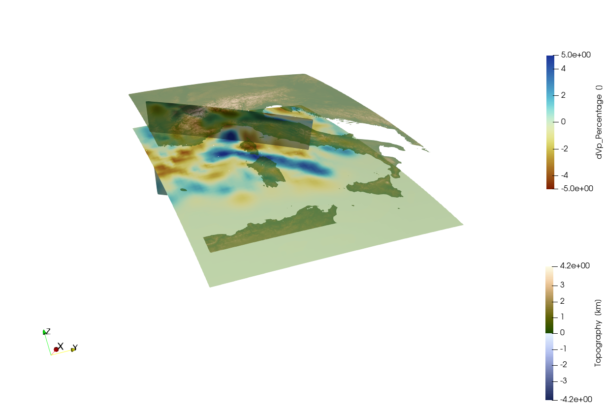
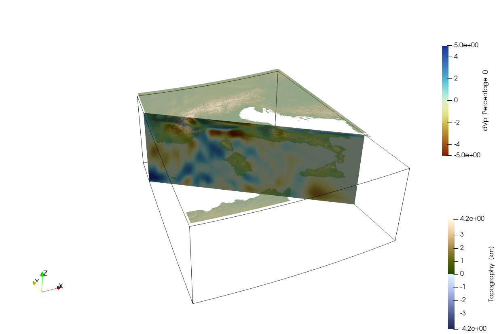
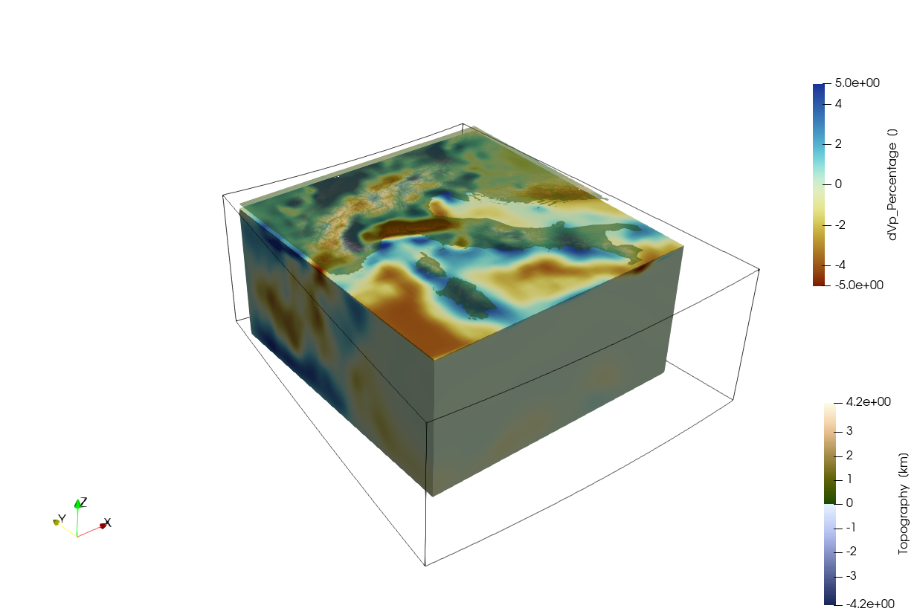

```@meta
EditURL = "../../../tutorials/Tutorial_Basic.jl"
```

# Getting started
### Aim:
The aim of this tutorial is to give you a feeling for the `GeophysicalModelGenerator` package.

### 1. Loading data
We start with loading the package, and assume that you have installed it:

```julia
using GeophysicalModelGenerator;
```

Lets load a first 3D seismic tomography data set of the Alps. We uploaded an example file on Zenodo [here](https://zenodo.org/records/10738510), which comes from the paper of [Paffrath et al. 2021](https://se.copernicus.org/articles/12/2671/2021/se-12-2671-2021.html).
We can load this in `GMG` with:

```julia
Tomo_Alps_full = load_GMG("https://zenodo.org/records/10738510/files/Paffrath_2021_SE_Pwave.jld2?download=1")
```

````
GeoData 
  size      : (162, 130, 42)
  lon       ϵ [ -13.3019 : 35.3019]
  lat       ϵ [ 30.7638 : 61.2362]
  depth     ϵ [ -606.0385 : 31.0385]
  fields    : (:dVp_Percentage,)

````

This is a so-called `GeoData` object, which is a 3D grid of seismic velocities as a function of longitude, latitude and depth, which can include various fields (here we only have a single field: `:dVp_Percentage`)
We can save this in `VTK` format, which is a widely used format that can for exampke be read by the 3D open-source visualization tool [Paraview](https://www.paraview.org/):

```julia
Write_Paraview(Tomo_Alps_full,"Tomo_Alps_full")
```

````
Saved file: Tomo_Alps_full.vts

````

We also uploaded a dataset with the topography of the Alpine region which can be downloaded with:

```julia
Topo_Alps = load_GMG("https://zenodo.org/records/10738510/files/AlpsTopo.jld2?download=1")
```

````
GeoData 
  size      : (961, 841, 1)
  lon       ϵ [ 4.0 : 20.0]
  lat       ϵ [ 36.0 : 50.0]
  depth     ϵ [ -4.181 : 4.377]
  fields    : (:Topography,)

````

Different than the 3D tomographic model, the topography has size 1 for the last index which indicates that this is a 3D surface. As you can see, the depth varies, which is because it is a warped surface.
We can write this to disk as well

```julia
Write_Paraview(Topo_Alps,"Topo_Alps")
```

````
Saved file: Topo_Alps.vts

````

If we open both datasets in Paraview, we see this (after giving some color to the topography):

Note that I use the `Oleron` scientific colormap for the tomography which you can download [here](https://www.fabiocrameri.ch/colourmaps/)

### 2. Extract subset of data
As you can see the tomographic data covers a much larger area than the Alps itself, and in most of that area there is no data.
It is thus advantageous to cut out a piece of the dataset that we are interested in which can be done with `ExtractSubVolume`:

```julia
Tomo_Alps = ExtractSubvolume(Tomo_Alps_full,Lon_level=(4,20),Lat_level=(36,50), Depth_level=(-600,-10))

Write_Paraview(Tomo_Alps,"Tomo_Alps");
```

````
Saved file: Tomo_Alps.vts

````

Which looks like:


### 3. Create cross sections
Paraview has the option to `Slice` through the data but it is not very intuitive to do this in 3D. Another limitation of Paraview is that it does not have native support for spherical coordinates, and therefore the data is translated to cartesian (`x`,`y`,`z`) coordinates (with the center of the Earth at `(0,0,0)`).
That makes this a bit cumbersome to make a cross-section at a particular location.
If you are interested in this you can use the `CrossSection` function:

```julia
data_200km = CrossSection(Tomo_Alps, Depth_level=-200)
```

````
GeoData 
  size      : (54, 60, 1)
  lon       ϵ [ 3.9057 : 19.9057]
  lat       ϵ [ 35.9606 : 49.8976]
  depth     ϵ [ -202.0385 : -202.0385]
  fields    : (:dVp_Percentage, :FlatCrossSection)

````

As you see, this is not exactly at 200 km depth, but at the closest `z`-level in the data sets. If you want to be exactly at 200 km, use the `Interpolate` option:

```julia
data_200km_exact = CrossSection(Tomo_Alps, Depth_level=-200, Interpolate=true)
```

````
GeoData 
  size      : (100, 100, 1)
  lon       ϵ [ 3.9057 : 19.9057]
  lat       ϵ [ 35.9606 : 49.8976]
  depth     ϵ [ -200.0 : -200.0]
  fields    : (:dVp_Percentage, :FlatCrossSection)

````

In general, you can get help info for all functions with `?`:
```julia
help?> CrossSection
search: CrossSection CrossSectionVolume CrossSectionPoints CrossSectionSurface FlattenCrossSection

  CrossSection(DataSet::AbstractGeneralGrid; dims=(100,100), Interpolate=false, Depth_level=nothing, Lat_level=nothing, Lon_level=nothing, Start=nothing, End=nothing, Depth_extent=nothing, section_width=50km)

  Creates a cross-section through a GeoData object.

    •  Cross-sections can be horizontal (map view at a given depth), if Depth_level is specified

    •  They can also be vertical, either by specifying Lon_level or Lat_level (for a fixed lon/lat), or by defining both Start=(lon,lat) & End=(lon,lat) points.

    •  Depending on the type of input data (volume, surface or point data), cross sections will be created in a different manner:

    1. Volume data: data will be interpolated or directly extracted from the data set.

    2. Surface data: surface data will be interpolated or directly extracted from the data set

    3. Point data: data will be projected to the chosen profile. Only data within a chosen distance (default is 50 km) will be used

    •  Interpolate indicates whether we want to simply extract the data from the data set (default) or whether we want to linearly interpolate it on a new grid, which has dimensions as specified in dims NOTE: THIS ONLY APPLIES TO VOLUMETRIC AND SURFACE DATA
       SETS

    •  'section_width' indicates the maximal distance within which point data will be projected to the profile

  Example:
  ≡≡≡≡≡≡≡≡

  julia> Lon,Lat,Depth   =   lonlatdepthGrid(10:20,30:40,(-300:25:0)km);
  julia> Data            =   Depth*2;                # some data
  julia> Vx,Vy,Vz        =   ustrip(Data*3),ustrip(Data*4),ustrip(Data*5);
  julia> Data_set3D      =   GeoData(Lon,Lat,Depth,(Depthdata=Data,LonData=Lon, Velocity=(Vx,Vy,Vz)));
  julia> Data_cross      =   CrossSection(Data_set3D, Depth_level=-100km)
  GeoData
    size  : (11, 11, 1)
    lon   ϵ [ 10.0 : 20.0]
    lat   ϵ [ 30.0 : 40.0]
    depth ϵ [ -100.0 km : -100.0 km]
    fields: (:Depthdata, :LonData, :Velocity)
```

Let's use this to make a vertical cross-section as well:

```julia
Cross_vert = CrossSection(Tomo_Alps, Start=(5,47), End=(15,44))
```

````
GeoData 
  size      : (100, 100, 1)
  lon       ϵ [ 5.0 : 15.0]
  lat       ϵ [ 47.0 : 44.0]
  depth     ϵ [ -606.0385 : -15.5769]
  fields    : (:dVp_Percentage, :FlatCrossSection)

````

And write them to paraview:

```julia
Write_Paraview(Cross_vert,"Cross_vert");
Write_Paraview(data_200km,"data_200km");
```

````
Saved file: Cross_vert.vts
Saved file: data_200km.vts

````


In creating this image, I used the `Clip` tool of Paraview to only show topography above sealevel and made it 50% transparent.

### 4. Cartesian data
As you can see, the curvature or the Earth is taken into account here. Yet, for many applications it is more convenient to work in Cartesian coordinates (kilometers) rather then in geographic coordinates.
`GeophysicalModelGenerator` has a number of tools for this.
First we need do define a `ProjectionPoint`  around which we project the data

```julia
proj = ProjectionPoint(Lon=12.0,Lat =43)

Topo_cart = convert2CartData(Topo_Alps, proj)
```

````
CartData 
    size    : (961, 841, 1)
    x       ϵ [ -748.7493528015041 : 695.3491277129204]
    y       ϵ [ -781.2344794653393 : 831.6826244089501]
    z       ϵ [ -4.181 : 4.377]
    fields  : (:Topography,)

````

And do the same with the tomography:

```julia
Tomo_cart = convert2CartData(Tomo_Alps, proj)
```

````
CartData 
    size    : (54, 60, 39)
    x       ϵ [ -757.8031278236692 : 687.0608438357591]
    y       ϵ [ -785.601866956207 : 821.3433749818317]
    z       ϵ [ -606.0385 : -15.5769]
    fields  : (:dVp_Percentage,)

````

Save:

```julia
Write_Paraview(Tomo_cart,"Tomo_cart");
Write_Paraview(Topo_cart,"Topo_cart");
```

````
Saved file: Tomo_cart.vts
Saved file: Topo_cart.vts

````


As the coordinates are now aligned with the `x`,`y`,`z` coordinate axes in Paraview it is now straightforward to use the build-in tools to explore the data.

### 5. Rectilinear data
Yet, because of the curvature of the Earth, the resulting 3D model is not strictly rectilinear, which is often a requiment for cartesian numerical models.
This can be achieved in a relatively straightforward manner, by creating a new 3D dataset that is slightly within the curved boundaries of the projected data set:

```julia
Tomo_rect = CartData(xyzGrid(-550.0:10:600, -500.0:10:700, -600.0:5:-17));
```

the routine `projectCartData` will then project the data from the geographic coordinates to the new rectilinear grid:

```julia
Tomo_rect = projectCartData(Tomo_rect, Tomo_Alps, proj)
```

````
CartData 
    size    : (116, 121, 117)
    x       ϵ [ -550.0 : 600.0]
    y       ϵ [ -500.0 : 700.0]
    z       ϵ [ -600.0 : -20.0]
    fields  : (:dVp_Percentage,)

````

we can do the same with topography:

```julia
Topo_rect = CartData(xyzGrid(-550.0:1:600, -500.0:1:700, 0))
Topo_rect = projectCartData(Topo_rect, Topo_Alps, proj)
```

````
CartData 
    size    : (1151, 1201, 1)
    x       ϵ [ -550.0 : 600.0]
    y       ϵ [ -500.0 : 700.0]
    z       ϵ [ -3.6366708734115245 : 4.2399313641768455]
    fields  : (:Topography,)

````

Save it:

```julia
Write_Paraview(Tomo_rect,"Tomo_rect");
Write_Paraview(Topo_rect,"Topo_rect");
```

````
Saved file: Tomo_rect.vts
Saved file: Topo_rect.vts

````



At this stage, the data can directly be used to generate cartesian numerical model setups, as explained in the other tutorials.

---

*This page was generated using [Literate.jl](https://github.com/fredrikekre/Literate.jl).*

