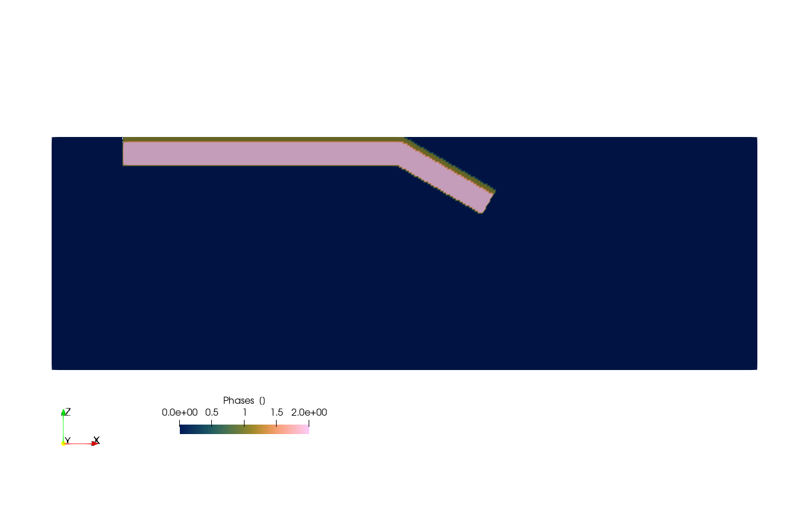
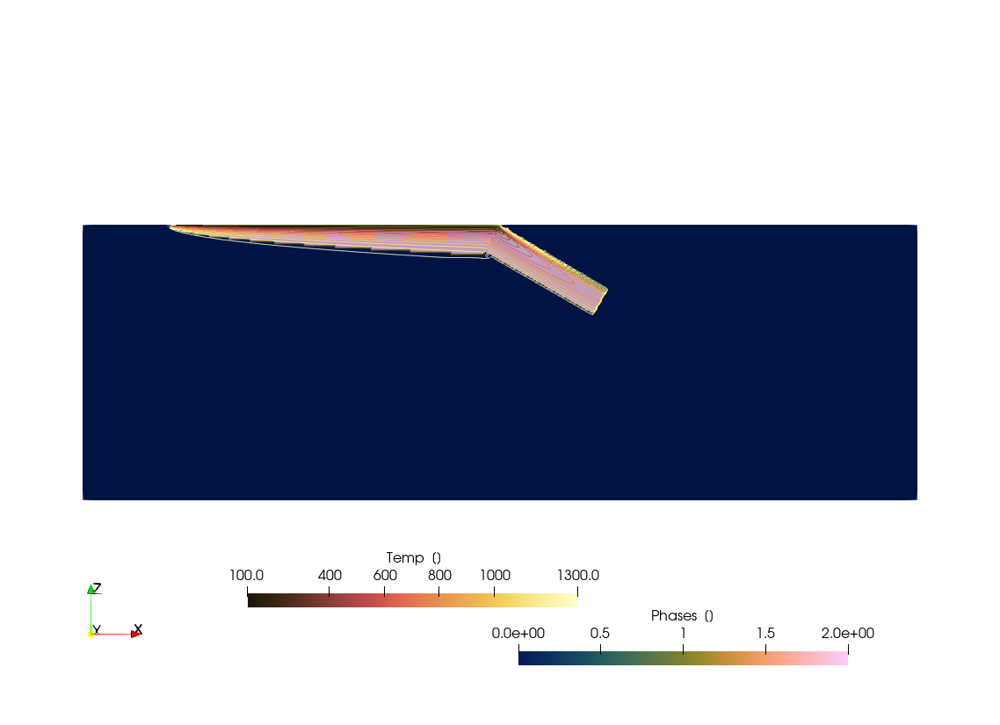

```@meta
EditURL = "../../../tutorials/Tutorial_NumericalModel_2D.jl"
```

# Creating 2D numerical model setups

### Aim
The aim of this tutorial is to show you how to create 2D numerical model setups that can be used as initial setups for other codes.

### 2D Subduction setup

Lets start with creating a 2D model setup in cartesian coordinates, which uses the `CartData` data structure

```julia
using GeophysicalModelGenerator

nx,nz = 512,128
x = range(-1000,1000, nx);
z = range(-660,0,    nz);
Grid2D = CartData(XYZGrid(x,0,z))
```

````
CartData 
    size    : (512, 1, 128)
    x       ϵ [ -1000.0 : 1000.0]
    y       ϵ [ 0.0 : 0.0]
    z       ϵ [ -660.0 : 0.0]
    fields  : (:Z,)

````

Now we create an integer array that will hold the `Phases` information (which usually refers to the material or rock type in the simulation)

```julia
Phases = zeros(Int64,size(Grid2D));
```

In many (geodynamic) models, one also has to define the temperature, so lets initiate it

```julia
Temp = ones(Float64,size(Grid2D))*1350;
```

#### Mechanical setup

We will start with a simple subduction setup, which consists of a horizontal part:

```julia
AddBox!(Phases, Temp, Grid2D; xlim=(-800,0.0), zlim=(-80.0, 0.0), phase = ConstantPhase(1));
```

And with the inclined part:

```julia
AddBox!(Phases, Temp, Grid2D; xlim=(0,300), zlim=(-80.0, 0.0), phase = ConstantPhase(1), DipAngle=30);
```

Add them to the `CartData` dataset:

```julia
Grid2D = addField(Grid2D,(;Phases, Temp))
```

````
CartData 
    size    : (512, 1, 128)
    x       ϵ [ -1000.0 : 1000.0]
    y       ϵ [ 0.0 : 0.0]
    z       ϵ [ -660.0 : 0.0]
    fields  : (:Z, :Phases, :Temp)

````

Which looks like

```julia
Write_Paraview(Grid2D,"Grid2D_SubductionMechanical");
```

````
Saved file: Grid2D_SubductionMechanical.vts

````


#### Add lithospheric layers
In many geodynamic models, the lithosphere consists of a crust and mantle (or upper crust, lower crust and mantle lithosphere).
We can use the function `LithosphericPhases` for this which is a simple way to set a lithospheric layering

```julia
lith = LithosphericPhases(Layers=[15 55], Phases=[1 2])
```

````
LithosphericPhases([15 55], [1 2], nothing)
````

and set the slab again:

```julia
AddBox!(Phases, Temp, Grid2D; xlim=(-800,0.0), zlim=(-80.0, 0.0), phase = lith);
AddBox!(Phases, Temp, Grid2D; xlim=(0,300), zlim=(-80.0, 0.0), phase = lith, DipAngle=30);
```

Which looks like:

```julia
Grid2D = addField(Grid2D,(;Phases, Temp))
Write_Paraview(Grid2D,"Grid2D_SubductionMechanicalLayered");
```

````
Saved file: Grid2D_SubductionMechanicalLayered.vts

````



#### Add halfspace cooling thermal structure
Sofar, we only created the mechanical structure but not the thermal part.
We can do that by specifying a thermal structure

```julia
therm = HalfspaceCoolingTemp(Age=40)
AddBox!(Phases, Temp, Grid2D; xlim=(-800,0.0), zlim=(-80.0, 0.0), phase = lith, T=therm);
AddBox!(Phases, Temp, Grid2D; xlim=(0,300), zlim=(-80.0, 0.0), phase = lith, T = therm, DipAngle=30);
```

Which looks like:

```julia
Grid2D = addField(Grid2D,(;Phases, Temp))
Write_Paraview(Grid2D,"Grid2D_SubductionHalfspaceCooling");
```

````
Saved file: Grid2D_SubductionHalfspaceCooling.vts

````


Note that you can specify several 1D thermal structures, such as
- `ConstantTemp`
- `LinearTemp`
- `HalfspaceCoolingTemp`
- `LithosphericTemp`  - which takes radioactive heating into account
- `SpreadingRateTemp` - which assumes that the plate moved away from a ridge and the thermal age increased accordingly
- `McKenzie_subducting_slab` - temperature of a slab that is heated by surrounding mantle

You can also average 1D profiles:
- `LinearWeightedTemperature` - Average 2 1D profiles along a distance

#### Add a ridge
Let's specify an oceanic thermal profile with a mid oceanic ridge at the left. For this, we use the `SpreadingRateTemp` function, and specify
a spreading velocity (note that this simply relates to the thermal structure and does not have to be the same as the subduction velocity you obtain in your geodynamic simulation).

```julia
lith = LithosphericPhases(Layers=[15 55], Phases=[1 2], Tlab=1250)
AddBox!(Phases, Temp, Grid2D; xlim=(-800,0.0), zlim=(-80.0, 0.0), phase = lith, T=SpreadingRateTemp(SpreadingVel=3));
```

For the subduction we use a thermal structure of a slab heated by hot asthenosphere

```julia
AddBox!(Phases, Temp, Grid2D; xlim=(0,300), zlim=(-80.0, 0.0), phase = lith, T = McKenzie_subducting_slab(Tsurface=0,v_cm_yr=3), DipAngle=30);
```

We can set the mantle lithosphere that is hotter > 1250 C to mantle:

```julia
ind = findall(Temp .> 1250 .&& Phases .==2);
Phases[ind] .= 0;

Grid2D = addField(Grid2D,(;Phases, Temp))
Write_Paraview(Grid2D,"Grid2D_SubductionRidge");
```

````
Saved file: Grid2D_SubductionRidge.vts

````



#### Overriding slab and weak layer
Ok, lets add an overriding slab as well. For this, we use the `AddLayer!` function

```julia
lith = LithosphericPhases(Layers=[15 20 55], Phases=[3 4 5], Tlab=1250)
AddBox!(Phases, Temp, Grid2D; xlim=(0,1000), zlim=(-80.0, 0.0), phase = lith, T=HalfspaceCoolingTemp(Age=80));
```

The oceanic plate is as before

```julia
lith = LithosphericPhases(Layers=[15 55], Phases=[1 2], Tlab=1250)
AddBox!(Phases, Temp, Grid2D; xlim=(-800,0.0), zlim=(-80.0, 0.0), phase = lith, T=SpreadingRateTemp(SpreadingVel=3));
```

For the inclined part, we set a layer above the slab (the "weak" layer to facilite subduction initiation )

```julia
lith = LithosphericPhases(Layers=[10 15 55], Phases=[6 1 2], Tlab=1250)
AddBox!(Phases, Temp, Grid2D; xlim=(0,300), zlim=(-80.0, 10.0), phase = lith, T = McKenzie_subducting_slab(Tsurface=0,v_cm_yr=3), DipAngle=30);
```

Lithosphere-asthenosphere boundary:

```julia
ind = findall(Temp .> 1250 .&& Phases .==2);
Phases[ind] .= 0;

Grid2D = addField(Grid2D,(;Phases, Temp))
Write_Paraview(Grid2D,"Grid2D_SubductionOverriding");
```

````
Saved file: Grid2D_SubductionOverriding.vts

````


### Other geometries
We have a number of other functions to help create a geometry, specifically:

- `AddLayer!`
- `AddSphere!`
- `AddEllipsoid!`
- `AddCylinder!`

The help functions are quite self-explanatory, so we won't show it in detail here.
If you have a topography surface or any other horizontal surface, you can surface with the cartesian grid with `aboveSurface` or `belowSurface`.

Also, if you wish to take a seismic tomography as inspiration to set a slab geometry, you can interpolate it to a `CartGrid` with the same dimensions and use that with the julia `findall` function.

---

*This page was generated using [Literate.jl](https://github.com/fredrikekre/Literate.jl).*

