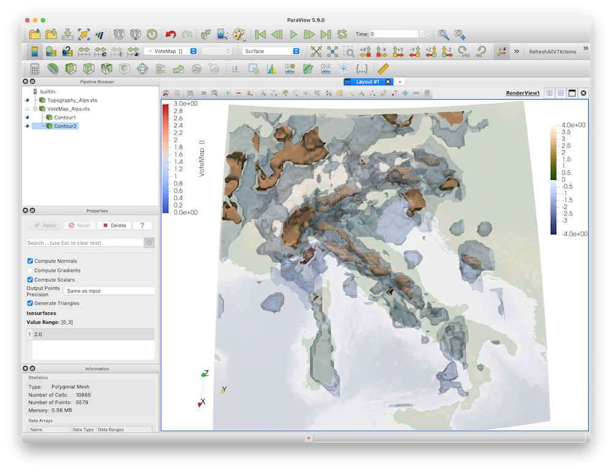

```@meta
EditURL = "../../../tutorials/Tutorial_Votemaps.jl"
```

# Votemaps

## Aim
In this tutorial, your will learn how to create Votemaps that compare different tomographic models and look for similarities between different models.

## Steps

#### 1. Load data
We assume that you have all tomographic models already available as *.JLD2 files. In our example we use the data uploaded to
[https://seafile.rlp.net/d/22b0fb85550240758552/](https://seafile.rlp.net/d/22b0fb85550240758552/)

Specifically, we will use the tomographic models of Paffrath, Zhao and Koulakov, as we have them all available in processed form
Download the corresponding `*.jld2` files to the same directory

```julia
using JLD2, GeophysicalModelGenerator

Pwave_Zhao = load("Zhao_Pwave.jld2","Data_set_Zhao2016_Vp")
PSwave_Koulakov = load("Koulakov_Europe.jld2","DataKoulakov_Alps")
Pwave_Paffrath = load("Paffrath_Pwave.jld2","Data_set_Paffrath2021_Vp")
```

The 3 data sets all contain tomographic models for roughly the alpine area, but as you can see, they all have a different resolution and the fields are sometimes called different as well:

```julia
Pwave_Paffrath
GeoData
  size  : (162, 130, 42)
  lon   ϵ [ -13.3019 : 35.3019]
  lat   ϵ [ 30.7638 : 61.2362]
  depth ϵ [ -606.0385 km : 31.0385 km]
  fields: (:dVp_Percentage, :Vp, :Resolution)

PSwave_Koulakov
  GeoData
  size  : (108, 81, 35)
  lon   ϵ [ 4.0 : 20.049999999999997]
  lat   ϵ [ 37.035928143712574 : 49.01197604790419]
  depth ϵ [ -700.0 km : -10.0 km]
  fields: (:dVp_percentage, :dVs_percentage)
```

#### 2. Creating a Votemap
The idea of `Votemaps` is rather simple:
- assume that a certain perturbation describes a feature (say, P wave anomalies >3% are interpreted to be slabs in the model of Paffrath)
- Everything that fulfills this criteria gets the number 1, everything else 0.
- Do the same with other tomographic models (using the same criteria or a different one).
- Make sure that all tomographic models are interpolated to the same grid.
- Sum up the 3 models.
- The resulting 3D map will have the number `3` at locations where all 3 models see a high-velocity anomaly (say a slab), implying that this feature is consistent between all models. Features that have a number 1 or 2 are only seen in a single or in 2/3 models.

The result of this gives a feeling which features are consistent between the 3 models. It is ofcourse still subjective, as you still have to choose a criteria and as we are assuming in this that the 3 tomographic models are comparable (which they are not as they are produced using different amounts of datam, etc. etc.)

So how do we create Votemaps?
Doing this is rather simple:

```julia
Data_VoteMap = VoteMap( [Pwave_Paffrath,       PSwave_Koulakov,    Pwave_Zhao],
                        ["dVp_Percentage>3.0","dVp_percentage>2.0","dVp_Percentage>2.0"], dims=(100,100,100))
```

This will look at the common `lon`,`lat`,`depth` ranges between all 3 models, interpret each of the models to a common grid of size `(100,100,100)` and apply each of the criteria specified
The resulting `GeoData` struct looks like:

```julia
GeoData
  size  : (100, 100, 100)
  lon   ϵ [ 4.0 : 18.0]
  lat   ϵ [ 38.0 : 49.01197604790419]
  depth ϵ [ -606.0385 km : -10.0 km]
  fields: (:VoteMap,)
```

And from this, we can generate profiles, visualize 3D features in Paraview etc. etc.

```julia
write_Paraview(Data_VoteMap, "VoteMap_Alps")
```

In paraview, this gives


You can ofcourse argue that newer tomographic models include more data & should therefore count more
A simple way to take that into account is to list the model twice:

```julia
Data_VoteMap = VoteMap( [Pwave_Paffrath,       Pwave_Paffrath,       PSwave_Koulakov,    Pwave_Zhao],
                        ["dVp_Percentage>3.0","dVp_Percentage>3.0", "dVp_percentage>2.0","dVp_Percentage>2.0"],
                        dims=(100,100,100))
```

Similarly, you could only look at a single model (even when that is perhaps easier done directly in paraview, where you can simply select a different isocontour value)

---

*This page was generated using [Literate.jl](https://github.com/fredrikekre/Literate.jl).*

