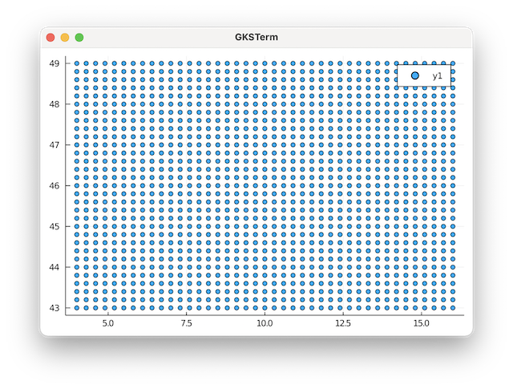
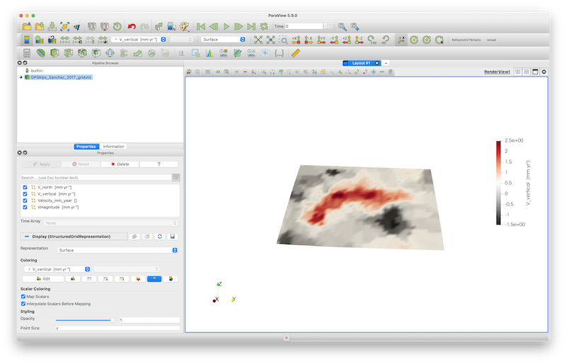
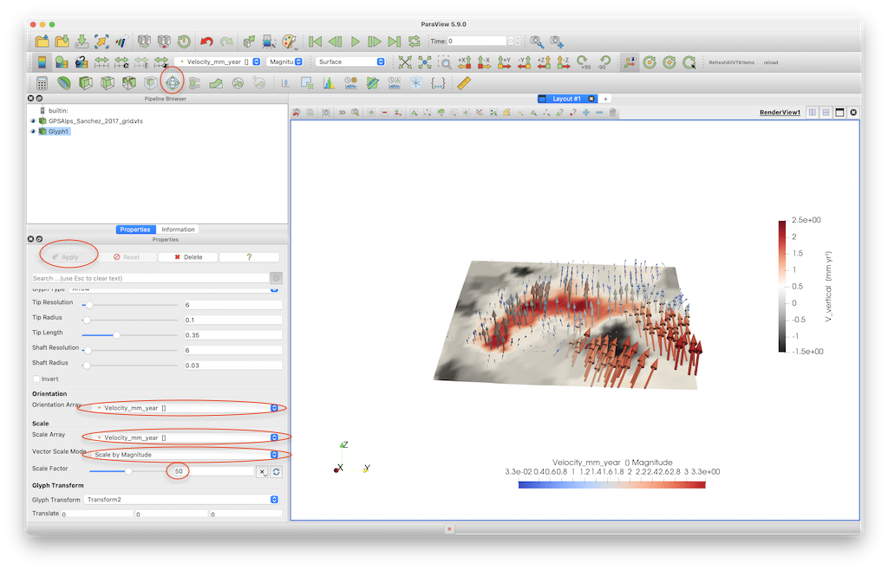

# Plot GPS data

## Goal

The aim of this tutorial is to show you how you can download and plot GPS data, which are vector data. 
The example is based on a paper by Sanchez et al. (2018) [https://essd.copernicus.org/articles/10/1503/2018/#section7](https://essd.copernicus.org/articles/10/1503/2018/#section7)


## Steps

#### 1. Download and import GPS data: 

The data related to the paper can be downloaded from: https://doi.pangaea.de/10.1594/PANGAEA.886889
There you will find links to several data sets. Some are the data on the actual stations and some are interpolated data on a grid. Here, we will use the gridded data as an example (which interpolates the ), and will therefore download the following data sets:

- ALPS2017_DEF_HZ	Surface deformation model of the Alpine Region	[https://store.pangaea.de/Publications/Sanchez-etal_2018/ALPS2017_DEF_HZ.GRD](https://store.pangaea.de/Publications/Sanchez-etal_2018/ALPS2017_DEF_HZ.GRD)
- ALPS2017_DEF_VT	Vertical deformation model of the Alpine Region	[https://store.pangaea.de/Publications/Sanchez-etal_2018/ALPS2017_DEF_VT.GRD](https://store.pangaea.de/Publications/Sanchez-etal_2018/ALPS2017_DEF_VT.GRD)

Next, we have a look at the data themselves. We will use the package `CSV.jl` to load the comma-separated data.
Let's have a look at the file `ALPS2017_DEF_VT.GRD`. If we open it with a text editor, we see that the data starts at line 18, and has the following format:
```
Column 1: Longitude [degrees]
Column 2: Latitude [degrees]
Column 3: Velocity in the height direction [m/a]
Column 4: Uncertainty of the height component [m/a]


 4.00    43.00    0.000067   0.000287
 4.30    43.00   -0.001000   0.000616
 4.60    43.00   -0.001067   0.000544
```
So we have 4 columns with data values, and the data is separated by spaces.
We can load that in julia as:
```julia
julia> using CSV, GeophysicalModelGenerator
julia> data_file =   CSV.File("ALPS2017_DEF_VT.GRD",datarow=18,header=false,delim=' ');
```
We can read the numerical data from the file with:
```julia
julia> data                    =   ParseColumns_CSV_File(data_file, 4);     
julia> lon_Vz, lat_Vz, Vz_vec  =   data[:,1], data[:,2], data[:,3];
```

#### 2. Check & reshape vertical velocity

Let's have a look at the data, by plotting it:
```julia
julia> using Plots
julia> Plots.scatter(lon_Vz,lat_Vz)
```

So clearly, this is a fully regular grid.
We can determine the size of the grid with 
```julia
julia> unique(lon_Vz)
41-element Vector{Float64}:
  4.0
  4.3
  4.6
  4.9
  5.2
  5.5
  5.8
  ⋮
 14.5
 14.8
 15.1
 15.4
 15.7
 16.0
julia> unique(lat_Vz)
31-element Vector{Float64}:
 43.0
 43.2
 43.4
 43.6
 43.8
 44.0
 44.2
  ⋮
 48.0
 48.2
 48.4
 48.6
 48.8
 49.0
```
So we have a `41` by `31` grid. GMG requires 3D matrixes for the data (as we want to plot the results in paraview in 3D). That is why we first initialize 3D matrixes for `lon,lat,Vz`:
```julia
julia> lon, lat, Vz            =   zeros(41,31,1),zeros(41,31,1),zeros(41,31,1)
```
And we can reshape the vectors accordingly:
```julia
julia> lon[:,:,1]              =   reshape(lon_Vz,(41,31))
julia> lat[:,:,1]              =   reshape(lat_Vz,(41,31))
julia> Vz[:,:,1]               =   reshape(Vz_vec,(41,31))
```


#### 3. Load horizontal velocities
Next, we load the horizontal velocities from the file ``

```julia
julia> data_file                       =   CSV.File("ALPS2017_DEF_HZ.GRD",datarow=18,header=false,delim=' ');
julia> data                            =   ParseColumns_CSV_File(data_file, 6);
julia> lon_Hz, lat_Hz, Ve_Hz, Vn_Hz    =   data[:,1], data[:,2], data[:,3],  data[:,4];
```

Let's plot the data as well:
```julia
julia> Plots.scatter(lon_Hz,lat_Hz)
```

So it appears that the horizontal velocities are given on the same regular grid as well, but not in the water. 
This thus requires a bit more work. The strategy we take is to first define 2D matrixes with horizontal velocities with the same size as Vz which are initialized with `NaN` (not a number), which is treated specially by Paraview.

```julia
julia> Ve = ones(size(Vz))*NaN;
julia> Vn = ones(size(Vz))*NaN;
```

Next we loop over all points in `lon_Hz,lat_Hz` and place them into the 2D matrixes:
```julia
julia>  for i in eachindex(lon_Hz)
            ind = intersect(findall(x->x==lon_Hz[i], lon), findall(x->x==lat_Hz[i], lat))
            Ve[ind] .= Ve_Hz[i];
            Vn[ind] .= Vn_Hz[i];
        end
```

At this stage, we have horizontal and vertical velocities in units of `m/yr`. Yet, given the small velocities in the Alps, it makes more sense to have them in units of `mm/yr`:
```julia
julia> Vz = Vz*1000;
julia> Ve = Ve*1000;
julia> Vn = Vn*1000;
```
And the magnitude is:
```julia
julia> Vmagnitude  =   sqrt.(Ve.^2 + Vn.^2 + Vz.^2);  
```

#### 4. Interpolate topography on grid
At this stage we have the 3D velocity components on a grid. Yet, we don't have information yet about the elevation of the stations (as the provided data set did not give this). 
We could ignore that and set the elevation to zero, which would allow saving the data directly to paraview.

Yet, a better way is to load the topographic map of the area and interpolate the elevation to the velocity grid. We are using the `GMT.jl` to load the topographic data:
```julia
julia> using GMT
julia> Elevation =   gmtread("@earth_relief_01m.grd", limits=[3,17,42,50]);
```

Next, we use the `Interpolations.jl` package to interpolate the topography:
```julia
julia> using Interpolations
julia> interpol = LinearInterpolation((Elevation.x[1:end-1], Elevation.y[1:end-1]), Elevation.z');    
julia> height   = interpol.(lon,lat)/1e3;
```

#### 5. Saving and plotting in Paraview
At this stage, we have all we need. As the velocity is a vector field, we need to save it as a data structure with 3 components. When saving to paraview, GMG internally does a vector transformation. As this transformation does not retain the `east/north` components of the velocity field, it is a good idea to save them as separate fields so we can color the vectors accordingly in Paraview. Also note that we do not attach units to the vector fields, but we do have them for the scalar fields:

```julia
julia> GPS_Sanchez_grid = GeoData(lon,lat,height,(Velocity_mm_year=(Ve,Vn,Vz),V_north=Vn*mm/yr, V_east=Ve*mm/yr, V_vertical=Vz*mm/yr, Vmagnitude = Vmagnitude*mm/yr, Topography = height*km))
GeoData 
  size  : (41, 31, 1)
  lon   ϵ [ 4.0 : 16.0]
  lat   ϵ [ 43.0 : 49.0]
  depth ϵ [ -2.6545 km : 3.426 km]
  fields: (:Velocity_mm_year, :V_north, :V_east, :V_vertical, :Vmagnitude, :Topography)
```
Saving this to paraview is as always:
```julia
julia> Write_Paraview(GPS_Sanchez_grid, "GPSAlps_Sanchez_2017_grid")
```

Opening and plotting the vertical field gives:


In order to plot the velocities as arrows, you need to select the `Glyph` tool (red circle). Also specify `Velocity_mm_year ()` as both Orientation and Scale Array, and add `50` as scale factor. Once you push `Apply` it should look like:


The arrows can now be colored by the individual velocity components or its magnitude.
