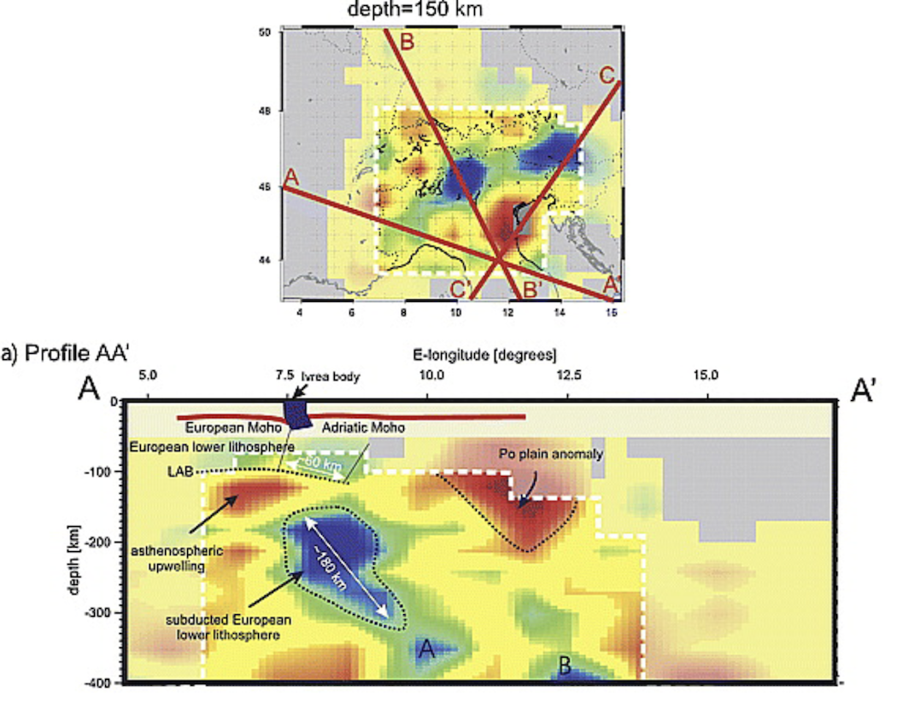
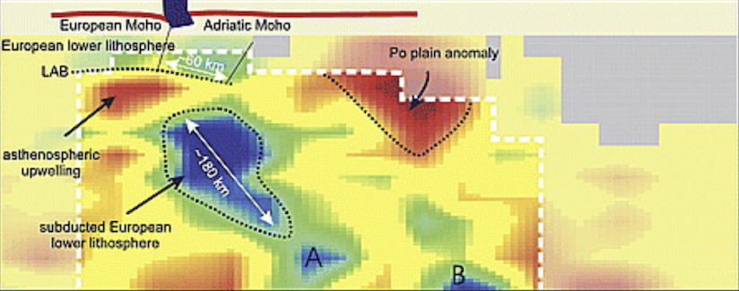
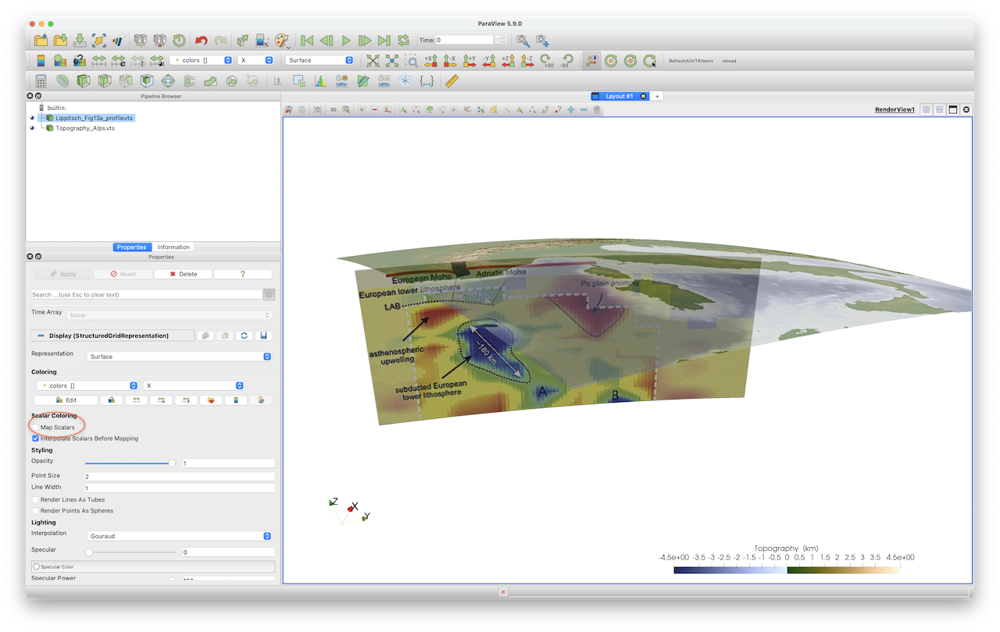
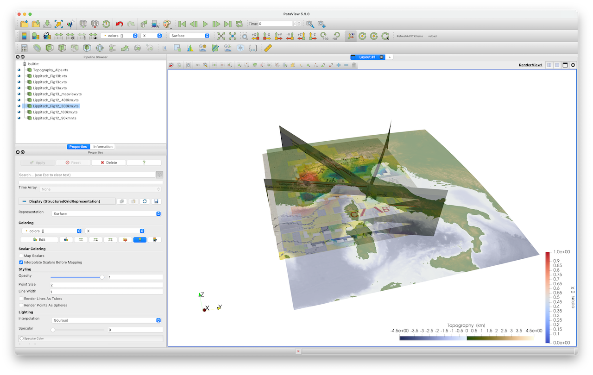

# Import profiles/maps from published papers 

## Goal
Ideally, all data should be availabe in digital format, after which you could use the tools described in the other tutorial to transform them into `GeoData` and export them to VTK.
Yet, the reality is different and often data is not (yet) available, or papers are old and the authors can no longer be contacted.

For that reason, `GeophysicalModelGenerator` has tools that allow you to transfer a screenshot from any published paper into `GeoData/Paraview` and see it in 3D at the correct geographic location. This can be done for vertical profiles and for mapviews, which gives you a quick and easy way to see those papers in a new (3D) light.

Here, we explain how. 

## General procedure
#### 1. Download data and crop images
For this example, we use a well-known paper about the Alps which is now openly available:

Lippitsch, R., 2003. Upper mantle structure beneath the Alpine orogen from high-resolution teleseismic tomography. J. Geophys. Res. 108, 2376. [https://doi.org/10.1029/2002JB002016](https://doi.org/10.1029/2002JB002016)


Figure 12 contains a number of horizontal slices @ different depth, whereas Figure 13 contains 3 vertical profiles and a mapview that illustrates where the profile was taken. The first profile is shown here:



The first step is to crop the image such that we only see the profile itself:



#### 2. Read data of a cross-section & create VTS file

We look at the bigger image and determine the `lon,lat,depth` coordinates of the lower left and upper right corners of this image. We estimate this to be at:
```julia
julia> Corner_LowerLeft  = ( 3.5, 46.0, -400.0)
julia> Corner_UpperRight = (16.0, 42.5, 0.0)
```
Once this is done, and we saved the picture under `Lippitsch_Fig13a.png`, you can transfer it into GeoData format with:

```julia
julia> using GeophysicalModelGenerator
julia> data_profile1 = Screenshot_To_GeoData("Lippitsch_Fig13a.png",Corner_LowerLeft, Corner_UpperRight)
Extracting GeoData from: Lippitsch_Fig13a.png
           └ Corners:         lon       lat       depth
              └ lower left  = [3.5    ; 46.0   ;  -400.0 ]
              └ lower right = [16.0   ; 42.5   ;  -400.0 ]
              └ upper left  = [3.5    ; 46.0   ;  0.0    ]
              └ upper right = [16.0   ; 42.5   ;  0.0    ]
GeoData 
  size  : (325, 824, 1)
  lon   ϵ [ 3.4999999999999996 : 16.0]
  lat   ϵ [ 42.49999999999999 : 46.00000000000001]
  depth ϵ [ -400.00000000000006 km : 0.0 km]
  fields: (:colors,)
```
Finally, you save it in Paraview format as always:
```julia
julia> Write_Paraview(data_profile1, "Lippitsch_Fig13a_profile") 
```

You can open this in paraview. Here, it is shown along with topographic data (made transparent):


Note that if you want to see the image with the original colors, you should *unselect* the `Map Scalars` option in the `Properties` tab (red ellipse).


#### 3. Read data of a mapview & create VTS file

Creating a map follows the same procedure. The only difference is that maps are sometimes distorted which means that the axis are not necessarily orthogonal in `lon/lat` space. In that case, you need to specify all 4 corners. Internally, we linearly interpolate between those values.

An example is given here, which uses the mapview of Fig. 13 of the same paper (@ 150 km depth):


```julia
Corner_LowerLeft    =   ( 3.5, 43.0 , -150.0)
Corner_UpperRight   =   (15.5, 50.0 , -150.0)
Corner_LowerRight   =   (15.5, 43.0 , -150.0)
Corner_UpperLeft    =   (3.5 , 50.0 , -150.0)
data_Fig13_map      =   Screenshot_To_GeoData("Fig13_mapview.png",Corner_LowerLeft, Corner_UpperRight, Corner_LowerRight=Corner_LowerRight,Corner_UpperLeft=Corner_UpperLeft)
Write_Paraview(data_Fig13_map, "Lippitsch_Fig13_mapview") 
```

Once added to paraview (together with a few additional map views from the same paper):  



#### 3. Julia script
For convenience we collected a few screenshots and uploaded it from [https://seafile.rlp.net/d/a50881f45aa34cdeb3c0/](https://seafile.rlp.net/d/a50881f45aa34cdeb3c0/).

The full julia script that interprets all the figures is given [here](https://github.com/JuliaGeodynamics/GeophysicalModelGenerator.jl/tree/main/tutorial/Lippitsch_Screenshots.jl).
```julia
julia> include("Lippitsch_Screenshots.jl")
```

