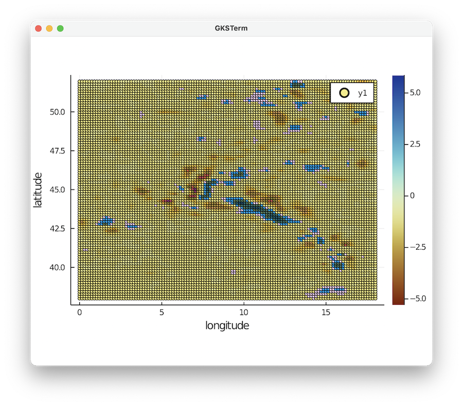
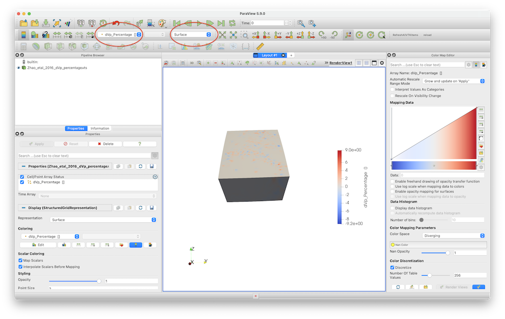
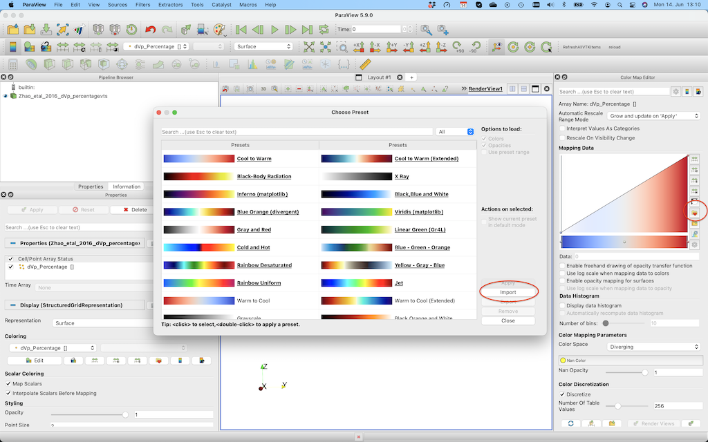
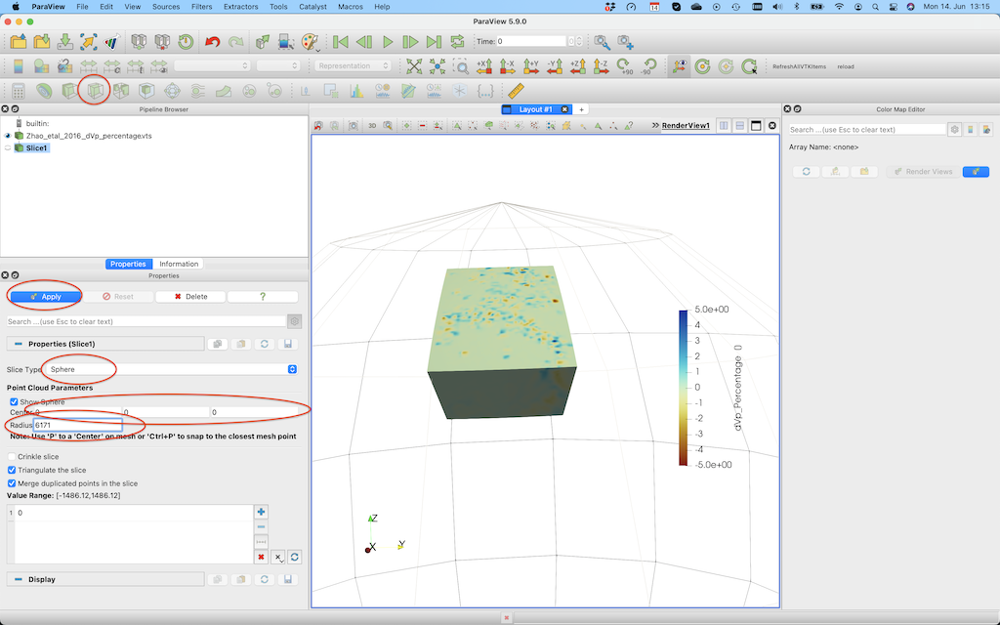
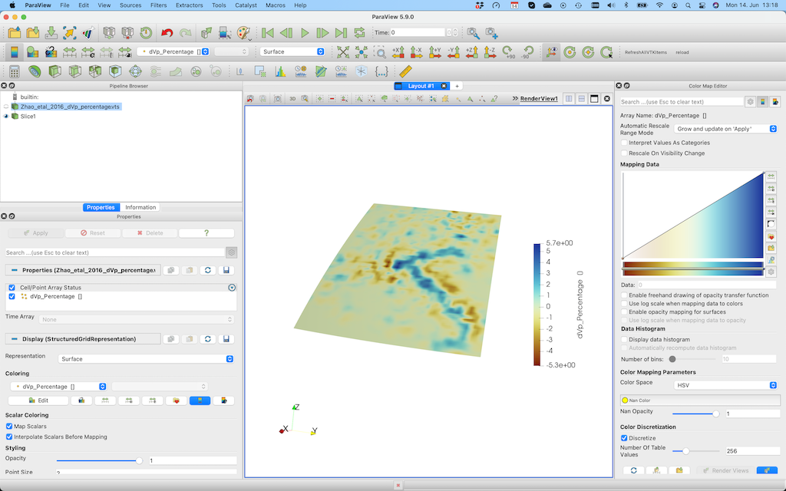
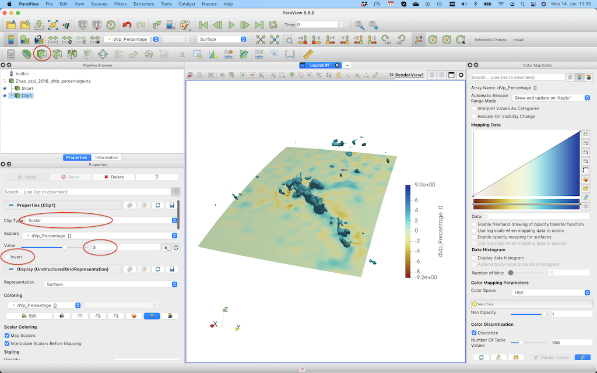

# 3D tomography model in CSV formation

## Goal
This explains how to load a 3D P-wave model and plot it in paraview as a 3D volumetric data set. The example is the P-wave velocity model of the alps as described in 

Zhao, L., Paul, A., Malusà, M.G., Xu, X., Zheng, T., Solarino, S., Guillot, S., Schwartz, S., Dumont, T., Salimbeni, S., Aubert, C., Pondrelli, S., Wang, Q., Zhu, R., 2016. *Continuity of the Alpine slab unraveled by high-resolution P wave tomography*. Journal of Geophysical Research: Solid Earth 121, 8720–8737. [doi:10.1002/2016JB013310](https://doi.org/10.1002/2016JB013310)


The data is given in ASCII format with longitude/latitude/depth/velocity anomaly (percentage) format.

## Steps
#### 1. Download data 
The data is can be downloaded from [https://seafile.rlp.net/d/a50881f45aa34cdeb3c0/](https://seafile.rlp.net/d/a50881f45aa34cdeb3c0/), where you should download the file `Zhao_etal_JGR_2016_Pwave_Alps_3D_k60.txt`. Do that and start julia from the directory where it was downloaded.

#### 2. Read data into Julia
The dataset has no comments, and the data values in every row are separated by a space. In order to read this into julia as a matrix, we can use the build-in julia package `DelimitedFiles`.    We want the resulting data to be stored as double precision values (`Float64`), and the end of every line is a linebreak (`\n`).
```julia
julia> using DelimitedFiles
julia> data=readdlm("Zhao_etal_JGR_2016_Pwave_Alps_3D_k60.txt",' ',Float64,'\n', skipstart=0,header=false)
1148774×4 Matrix{Float64}:
  0.0   38.0   -1001.0  -0.113
  0.15  38.0   -1001.0  -0.081
  0.3   38.0   -1001.0  -0.069
  0.45  38.0   -1001.0  -0.059
  0.6   38.0   -1001.0  -0.055
  0.75  38.0   -1001.0  -0.057
  ⋮                     
 17.25  51.95     -1.0  -0.01
 17.4   51.95     -1.0  -0.005
 17.55  51.95     -1.0   0.003
 17.7   51.95     -1.0   0.007
 17.85  51.95     -1.0   0.006
 18.0   51.95     -1.0   0.003
```
Next, extract vectors from it:
```julia
julia> lon        = data[:,1];
julia> lat        = data[:,2];
julia> depth      = data[:,3];
julia> dVp_perc   = data[:,4];
```
Note that depth needs to with negative numbers.

#### 3. Reformat the data

Let's first have a look at the depth range of the data set:
```julia
julia> Depth_vec = unique(depth)
101-element Vector{Float64}:
 -1001.0
  -991.0
  -981.0
  -971.0
  -961.0
  -951.0
     ⋮
   -51.0
   -41.0
   -31.0
   -21.0
   -11.0
    -1.0
```
So the data has a vertical spacing of 10 km.
Next, let's check if the data is spaced in a regular manner in Lon/Lat direction. 
For that, we read the data at a given depth level (say -101km) and plot it using the `Plots` package (you may have to install that first on your machine).
```julia
julia> using Plots
julia> ind=findall(x -> x==-101.0, depth)
julia> scatter(lon[ind],lat[ind],marker_z=dVp_perc[ind], ylabel="latitude",xlabel="longitude",markersize=2.5, c = :roma)
```


Note that we employ the scientific colormap `roma` here. [This](https://docs.juliaplots.org/latest/generated/colorschemes/) gives an overview of available colormaps. You can download the colormaps for Paraview [here](https://www.fabiocrameri.ch/visualisation/).  

Clearly, the data is given as regular Lat/Lon points:

```julia
julia> unique(lon[ind])
121-element Vector{Float64}:
  0.0
  0.15
  0.3
  0.45
  0.6
  0.75
  ⋮
 17.25
 17.4
 17.55
 17.7
 17.85
 18.0
julia> unique(lat[ind])
94-element Vector{Float64}:
 38.0
 38.15
 38.3
 38.45
 38.6
 38.75
  ⋮
 51.2
 51.35
 51.5
 51.65
 51.8
 51.95
```

#### 3.1 Reshape data and save to paraview
Next, we reshape the vectors with lon/lat/depth data into 3D matrixes:
```
julia> resolution =  (length(unique(lon)), length(unique(lat)), length(unique(depth)))
(121, 94, 101)
julia> Lon          = reshape(lon,      resolution);
julia> Lat          = reshape(lat,      resolution);
julia> Depth        = reshape(depth,    resolution);
julia> dVp_perc_3D  = reshape(dVp_perc, resolution);
```

Check that the results are consistent
```julia
julia> iz=findall(x -> x==-101.0, Depth[1,1,:])
1-element Vector{Int64}:
 91
julia> data=dVp_perc_3D[:,:,iz];
julia> heatmap(unique(lon), unique(lat),data[:,:,1]', c=:roma,title="$(Depth[1,1,iz]) km")
```


So this looks good.

Next we create a paraview file:
```julia
julia> using GeophysicalModelGenerator
julia> Data_set    =   GeoData(Lon,Lat,Depth,(dVp_Percentage=dVp_perc_3D,))
GeoData 
  size  : (121, 94, 101)
  lon   ϵ [ 0.0 - 18.0]
  lat   ϵ [ 38.0 - 51.95]
  depth ϵ [ -1001.0 km - -1.0 km]
  fields: (:dVp_Percentage,)
julia> Write_Paraview(Data_set, "Zhao_etal_2016_dVp_percentage")
1-element Vector{String}:
 "Zhao_etal_2016_dVp_percentage.vts"
```

#### 4. Plotting data in Paraview
In paraview you can open the file and visualize it. 



The red ellipses show some of the properties you have to select. 
This employs the default colormap, which is not particularly good.

You can change that by importing the roma colormap (using the link described earlier). For this, open the colormap editor and click the one with the heart on the right hand side. Next, import roma and select it.



In order to change the colorrange select the button in the red ellipse and change the lower/upper bound.


If you want to create a horizontal cross-section @ 200 km depth, you need to select the `Slice` tool, select `Sphere` as a clip type, set the center to `[0,0,0]` and set the radius to `6171` (=radius earth - 200 km).




After pushing `Apply`, you'll see this:



If you want to plot iso-surfaces (e.g. at -3%), you can use the `Clip` option again, but this time select `scalar` and don't forget to unclick `invert`.




#### 5. Julia script

The full julia script that does it all is given [here](https://github.com/JuliaGeodynamics/GeophysicalModelGenerator.jl/blob/main/tutorial/Alps_VpModel_Zhao_etal_JGR2016.jl). You need to be in the same directory as in the data file, after which you can run it in julia with
```julia
julia> include("Alps_VpModel_Zhao_etal_JGR2016.jl")
```


